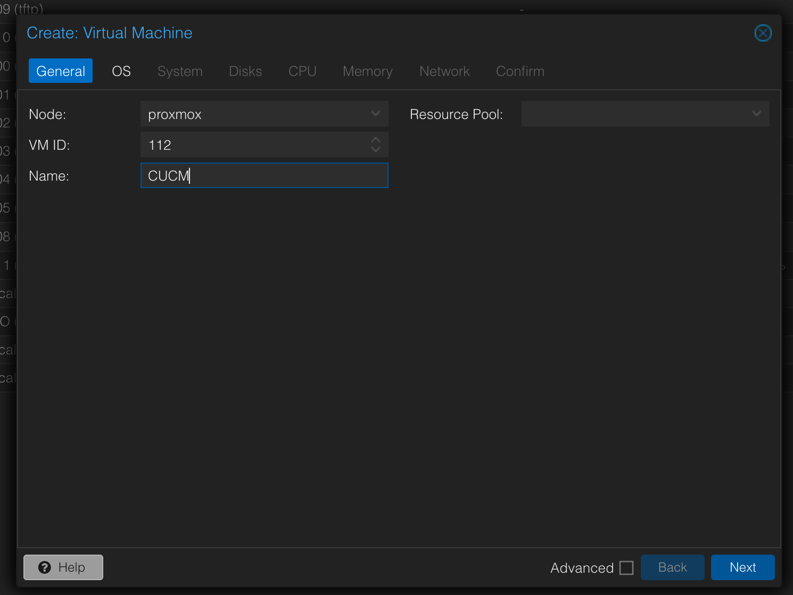

# How to install CUCM on Proxmox?
Welcome to my guide. I will show you how you can install Cisco Unified Communications Manager (CUCM) on Proxmox virtual environment. Many people install VMware ESXI on proxmox to run CUCM but this is not necessary most of the time.

---

### Prerequisites
- CUCM 14.0.1.11900-132 ISO
    - [Direct download](https://archive.org/download/cucm-14.0/BOOT-UCSInstall_UCOS_14.0.1.11900-132.sha512.iso)
    - [Torrent (file)](https://archive.org/download/cucm-14.0/cucm-14.0_archive.torrent)
- Proxmox version 9.0.3 (Latest at the time of writing, I tested it on version 7.4 and it didn't work, not tested on version 8)
- KVM conversion script, I forked this and modified it a bit so it works now. [Link](https://github.com/buba0/create-cucm-kvm-iso)
- Linux mint (OS I was using)

---
### Step 1: ISO creation
Make a directory in which you're going to be working
```sh
mkdir cucm-kvm
```
CD into that directory
```sh
cd cucm-kvm
```
Once you're in the directory, you can download your files (or transfer them any way you like)
```sh
curl -L -O "https://archive.org/download/cucm-14.0/BOOT-UCSInstall_UCOS_14.0.1.11900-132.sha512.iso"
```
```sh
curl -L -O "https://raw.githubusercontent.com/buba0/create-cucm-kvm-iso/refs/heads/master/create_cucm_kvm_iso.sh"
```
Make the script executable
```sh
sudo chmod +x create_cucm_kvm_iso.sh
```
And finally make the ISO
```sh
sudo bash create_cucm_kvm_iso.sh BOOT-UCSInstall_UCOS_14.0.1.11900-132.sha512.iso BOOT-UCSInstall_UCOS_14.0.1.11900-132.sha512-kvm.iso
```
notice that `-kvm` at the end of the second filename? It's there on purpose, we'll remove it.

copy the iso to a different directory or delete the original one and rename the created one. ***THIS STEP IS IMPORTANT***
```sh
rm BOOT-UCSInstall_UCOS_14.0.1.11900-132.sha512.iso
```
```sh
cp BOOT-UCSInstall_UCOS_14.0.1.11900-132.sha512-kvm.iso BOOT-UCSInstall_UCOS_14.0.1.11900-132.sha512.iso
```

### Step 2: Upload ISO
Now you're going to upload the ISO to the proxmox node


### Step 3: VM creation
Press "Create VM"

Give your VM a name

Use the ISO image that you uploaded

On the System tab, leave as default

Create a 80GB (more is recommended) SCSI Hard Drive

Give it at least 2 cores

Give it at least 8GB (More is recommended)

Here's an important step, set the network card model as "VMware vmxnet3" otherwise the install will fail

Finish creating the VM and start it.

### Step 4: Installation
Installing the system migh take a long time so be sure to do this when you have the time.
I'm going to give you screenshots of what to press during the initial installation.


Press skip

Press OK

Press YES

Press PROCEED

Press NO

Press CONTINUE

Select your timezone and press OK

Press YES

Press NO

Press NO

Enter your IP settings, make sure nothing else is using the IP you intend to put here

Press NO

Enter your username and password for logging into the web GUI and press OK

Enter some bogus company info and press OK

Press YES

Press YES

Enter an NTP server, find one with a static IP, you cannot use a domain name here as we did not set up DNS, you can try setting it up but it tries to do a rDNS lookup and fails. Press OK

Enter some password you'll remember and press OK

Press NO

Select disable all call home on system startup and press OK

Enter a username and password, I usually put the same as the first one and press OK

Press OK


Now you wait untill it's done installing, as I said earlier it might take a long time. If you encounter a problem where the system doesn't boot and goes straight to the installer do the following:
- Detatch the SCSI disk image from the VM
- Delete the SCSI interface
- Add a new SATA drive
- Attatch the disk image to the SATA drive
- Detach the ISO from the VM
- Try to boot

### Step 5: Initial installation done!
### Step 6: Initial configuration:
I'm not going to go deep in to the initial configuration here as this is just a guide on how to install CUCM on Proxmox. I'm going to tell you the most important thing. TURN ON TFTP SERVICE IN SERVICABILITY.
More info here: [PDF](images/CUCM%20Setup.pdf)


# ***`MORE TO COME TO THIS GUIDE STAY TUNED!!!!!!`***

---

## Contact
If you have any questions, feel free to reach out at [kubab945@gmail.com](mailto:kubab945@gmail.com).

Or open a [GitHub issue](https://github.com/buba0/Install-CUCM14-on-proxmox/issues).

&copy; 2025 [buba.net.pl](https://buba.net.pl)


## Star History

<a href="https://www.star-history.com/#buba0/Install-CUCM14-on-proxmox&type=date&legend=bottom-right">
 <picture>
   <source media="(prefers-color-scheme: dark)" srcset="https://api.star-history.com/svg?repos=buba0/Install-CUCM14-on-proxmox&type=date&theme=dark&legend=bottom-right" />
   <source media="(prefers-color-scheme: light)" srcset="https://api.star-history.com/svg?repos=buba0/Install-CUCM14-on-proxmox&type=date&legend=bottom-right" />
   
 </picture>
</a>
